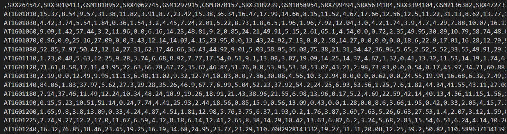
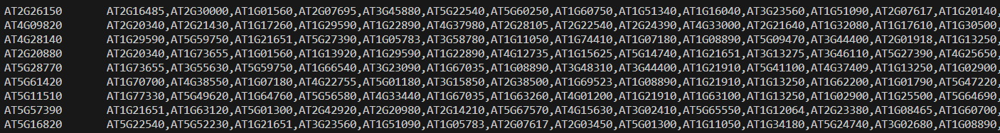
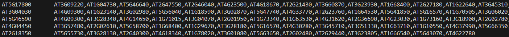

# InferReg

## Introduction

InferReg is a GNN-based tool for inferring gene regulatory networks from high-throughput genomic data. It leverages the latest advances in machine learning to provide users with an accurate and efficient way to predict regulatory interactions between transcription factors (TFs) and target genes.

## Usage

Here is a step-by-step guide on how to use InferReg:

### environment setup

Users of InferReg need to correctly set up Python 3, pandas, PyTorch, and PyTorch Geometry (PyG) in the local environment. To facilitate a seamless installation process, please refer to the following comprehensive guides tailored for each library:

1. Python3 >= 3.8.
2. pandas: Pandas can be easily installed using pip, Python's package installer.
3. PyTorch: To install PyTorch with support for your specific hardware (CPU or GPU) and operating system, visit the official installation page: https://pytorch.org/get-started/locally/
4. PyTorch Geometric (PyG): For installing PyG, a library dedicated to deep learning on irregularly structured data such as graphs, consult its official documentation at: https://pytorch-geometric.readthedocs.io/en/latest/index.html

### Data Preparation

Prepare the following files in the `code/data/raw` directory:
- `gene_expression.csv`: A CSV file containing gene expression data with gene names in rows and sample names in columns. Below is a sample snapshot of the file: 
    
- `edges.tsv`: A TSV file with edge information, where each row represents a TF and its target genes. Below is a sample snapshot of the file:
    
- `pos_edges.tsv`: A TSV file containing positive edge information validated by ChIP-Seq data.
    

Sample data files(Arabidopsis) are provided at the `https://doi.org/10.5281/zenodo.11176206`

### Data Preprocessing

Navigate to the `code/src/data_preprocess` directory and run `python data_loader.py` to load the input data.

### Model Training

To train the model, execute `python model_fit.py` from the `code` directory. There is no need to set any parameters.

### Prediction

To make a prediction, run `python predict.py` from the `code` directory. The predicted regulatory relationships will be saved in the `data/predicted/at_edges.tsv` file. The path `data/predicted` will be automatically generated upon the first execution.
